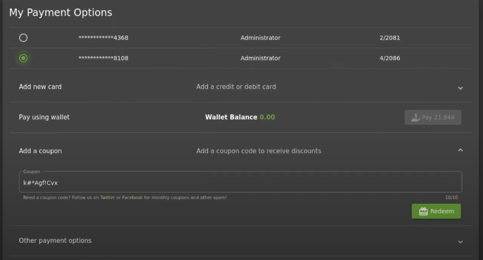

# Forged Coupon
## Challenge Overview
**Title**: Forged Coupon  
**Category**: Cryptography  
**Difficulty**: 6/6

This challenge revolves around reverse engineering. To solve it, you need to figure out which algorithm is used to create discount coupons and exploit this by forging a valid coupon to use in the Juice Shop.

## Tools
- **CyberChef**: A powerful tool for encoding/decoding and cryptography operations.  
- **Cryptii**: An online encoder/decoder that supports various encoding algorithms, including Base85 (Z85).

## Solution
To solve this challenge, the `~/ftp` directory must already be accessible. Once you have access, you should explore the following files:


### 1. Access the Encrypted Coupons:
- File: `http://localhost:3000/ftp/coupons_2013.md.bak%2500.md`  
  This file contains the encrypted coupons. Below is an example of the encrypted coupon codes:

  ```
  n<MibgC7sn
  mNYS#gC7sn
  o*IVigC7sn
  k#pDlgC7sn
  o*I]pgC7sn
  n(XRvgC7sn
  n(XLtgC7sn
  k#*AfgC7sn
  q:<IqgC7sn
  pEw8ogC7sn
  pes[BgC7sn
  l}6D$gC7ss
  ```

### 2. Investigate the `package.json` File:
- File: `http://localhost:3000/ftp/package.json.bak%2500.md`  
  By checking this file, you can inspect the project’s dependencies to identify the algorithm used for encoding the coupons. In this case, the relevant entry is:
  
  ```json
  "z85": "~0.0"
  ```

  This indicates that **Z85**, which is a Base85 encoding library for Node.js, is being used to encode the coupons.

### 3. Decode the Coupons:
- Use tools like **CyberChef** or **Cryptii** to decode the encrypted coupon codes using the Z85 decoding method. Once decoded, you can use the forged coupon codes within the Juice Shop to complete the challenge.


From the figure we have noticed that it is a history of 13/1/2010.



WE ARE DONE!!

## Remediation
&rarr; Use more secure method that is not easily predicted and reversed.

 &rarr; files such as ```package.json``` should not be that exposed to client side.