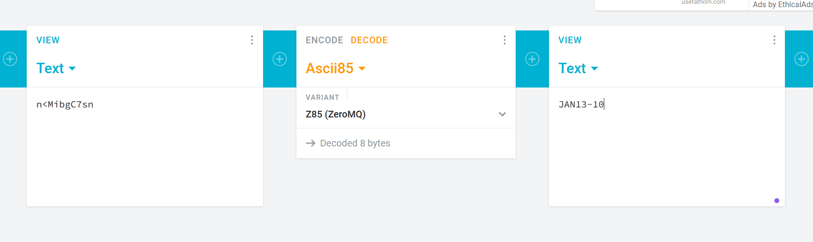

# Juice Shop Write-up: Forged Coupon

## Challenge Overview

**Title**: Forged Coupon  
**Category**: Cryptography  
**Difficulty**:(6/6)

This challenge is focused on reverse engineering. The goal is to determine the encoding algorithm used to create discount coupons and exploit it by forging a valid coupon to use in the Juice Shop application.

## Tools

- **CyberChef**: A tool for various encoding, decoding, and cryptographic operations.  
- **Cryptii**: An online platform supporting multiple encoding schemes, including Base85 (Z85).

## Methodology and Solution

### Step 1: Access the Encrypted Coupons

The first step is to access the directory where the encrypted coupons are stored. This can be done by navigating to the following file in the Juice Shop application:

- URL: `http://localhost:3000/ftp/coupons_2013.md.bak%2500.md`  

The content of the file consists of encrypted coupon codes. Below is a snippet of some of the coupon codes found in the file:

```plaintext
n<MibgC7sn  
mNYS#gC7sn  
o*IVigC7sn  
k#pDlgC7sn  
o*I]pgC7sn  
n(XRvgC7sn  
n(XLtgC7sn  
k#*AfgC7sn  
q:<IqgC7sn  
pEw8ogC7sn  
pes[BgC7sn  
l}6D$gC7ss  
```

### Step 2: Investigate the `package.json` File

Next, we investigate the `package.json` file, which holds details about the project’s dependencies. This file can be accessed via:

- URL: `http://localhost:3000/ftp/package.json.bak%2500.md`  

In the file, we find that the project uses the **Z85** library for encoding. Specifically, we see the following line in the dependencies:

```json
"z85": "~0.0"
```

Z85 is a Base85 encoding scheme, which is commonly used in cryptographic applications to encode binary data into text format.

### Step 3: Decode the Coupons

Now that we know the coupons are encoded using **Z85**, the next step is to decode them. Using tools like **CyberChef** or **Cryptii**, apply the **Z85 decoding** method to the encrypted coupon strings from the file. Once decoded, you will retrieve the original, valid coupon codes.

These codes can be used to exploit the Juice Shop application by applying them at checkout.

### Visual Evidence

Here are screenshots of the process:

- The history of coupon files from 2010:  
  

- The final decoded coupon codes ready for use:  
  

**We are done!** Once you have successfully decoded the coupons and applied them in the Juice Shop, the challenge is completed.

## Remediation

- **Secure Algorithms**: Use more secure and complex encoding methods that are not easily reversible or predictable.  
- **Sensitive Files Exposure**: Files like `package.json`, which reveal the encoding methods, should not be accessible client-side. Proper access control must be implemented to prevent such exposures.

## Impact

- **Vulnerability**: Exposure of encoding libraries can lead to the reverse engineering of sensitive data (e.g., coupon codes).  
- **Exploitability**: Attackers can easily reverse-engineer encoded values using publicly available libraries, leading to unauthorized access or misuse of features like discount coupons.

## Vulnerability Assessment

- **Severity Score**: High (7.9/10)  
- **Impact Score**: High, as it affects business logic (coupon generation and redemption), leading to potential financial loss.
