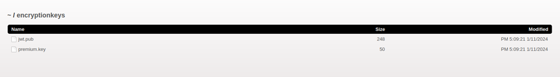

# Juice-Shop Write-up: Unlock Premium Challenge

## Challenge Overview

**Title:** Unlock Premium Challenge  
**Category:** Cryptographic Issues  
**Difficulty:**  (6/6)

This exciting challenge is about breaking through the Juice Shop’s simulated “premium content” paywall, without making any actual payments! The fun begins when you uncover an encryption key that grants access to the hidden premium section of the application. The ultimate goal? Bypass the paywall and reveal the hidden content.

## Tools Used

- **Web Browser**: Your trusty sidekick to explore and interact with Juice Shop.
- **Encryption Key Directory**: Where the magic key is found.
- **OpenSSL**: The essential tool for decrypting the encoded data.

## Methodology and Solution

### Step 1: Finding the Encryption Key

Through directory brute-forcing, we struck gold by locating a directory called:
```
http://127.0.0.1:3000/encryptionkeys
```
Inside this directory was a file named `premium.key`. Boom! This was the key we needed to unlock the premium section.



### Step 2: Analyzing the Key

Upon opening the `premium.key` file, we discovered a hexadecimal string:

```
1337133713371337.EA99A61D92D2955B1E9285B55BF2AD42
```

This hinted at being part of an AES-128 encryption scheme. It was now clear we had to decrypt some encrypted content using this key!

**Note:** If you want to save some time, you can fetch this file directly from the repository.

### Step 3: Searching for Encrypted Data

Now that we had the key, the hunt began to locate some encrypted content. Initially, the source code didn’t give us what we were looking for. However, a helpful hint from the OWASP Juice Shop guide directed us to an encrypted comment buried in the code, though not always visible:

```
<!--IvLuRfBJYlmStf9XfL6ckJFngyd9LfV1JaaN/KRTPQPidTuJ7FR+D/nkWJUF+0xUF07CeCeqYfxq+OJVVa0gNbqgYkUNvn//UbE7e95C+6e+7GtdpqJ8mqm4WcPvUGIUxmGLTTAC2+G9UuFCD1DUjg==-->
```

### Step 4: Decrypting the Encrypted URL

With the key in hand, we used OpenSSL to decrypt this Base64-encoded string, revealing the hidden URL:

```bash
echo "IvLuRfBJYlmStf9XfL6ckJFngyd9LfV1JaaN/KRTPQPidTuJ7FR+D/nkWJUF+0xUF07CeCeqYfxq+OJVVa0gNbqgYkUNvn//UbE7e95C+6e+7GtdpqJ8mqm4WcPvUGIUxmGLTTAC2+G9UuFCD1DUjg==" | openssl enc -d -aes-256-cbc -K EA99A61D92D2955B1E9285B55BF2AD42 -iv 337133713371337 -a -A
```

The decrypted URL led to the hidden paywall page:

```
http://localhost:3000/this/page/is/hidden/behind/an/incredibly/high/paywall/that/could/only/be/unlocked/by/sending/1btc/to/us
```

### Step 5: Unlocking the Premium Section

By navigating to the decrypted URL, we successfully bypassed the Juice Shop paywall without paying a cent, revealing the premium content and completing the challenge!

## Solution Explanation

This challenge highlights the importance of securely storing encryption keys and preventing client-side access to sensitive resources. By exploiting exposed keys and decrypting hidden URLs, we bypassed the paywall—showcasing how easy it can be for attackers to circumvent protections if encryption keys aren’t properly secured.

## Remediation

- **Secure Key Storage**: Always store encryption keys in a secure location, away from publicly accessible directories.
- **Access Control**: Implement strict authentication and access controls for premium or sensitive content.

## Vulnerability Assessment and Severity Score

- **Impact**: This vulnerability allows users to bypass payment mechanisms and access restricted content, leading to potential revenue loss and exposure of sensitive materials.
- **Severity**: High (9.1)  
